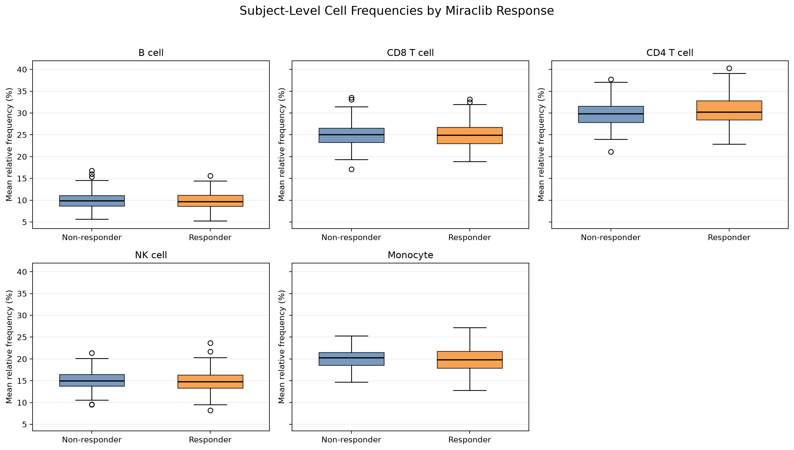

# Teiko Immune Cell Analysis

Exploring and analyzing immune cell count data with Python.

## Dataset

The project currently uses `cell-count.csv`. Each row represents one biological sample and includes project, subject, condition, treatment, response, sample type, treatment time, and cell counts for five immune-cell populations.

### Initial inspection

- 10,500 rows and 15 columns
- 3 projects
- 3,500 subjects
- 10,500 unique samples
- 3 samples per subject
- Time points at days 0, 7, and 14
- Conditions: carcinoma, healthy, and melanoma
- Treatments: miraclib, phauximab, and none
- Sample types: PBMC and WB
- Cell populations: B cell, CD8 T cell, CD4 T cell, NK cell, and monocyte
- No duplicate rows or duplicate sample identifiers
- 1,422 missing response values; all other columns are complete

## Run in GitHub Codespaces

Run the required Make targets from the repository root:

```bash
make setup
make pipeline
make dashboard
```

`make setup` installs the Python and dashboard dependencies, `make pipeline` creates the SQLite database and all analysis outputs, and `make dashboard` builds and starts the dashboard on port 8000.

## Manual setup

Create a virtual environment and install the Python dependencies:

```bash
python3 -m venv .venv
source .venv/bin/activate
python -m pip install -r requirements.txt
```

## Database design

The SQLite database is organized into five related tables:

- **Projects** stores each research project once.
- **Subjects** stores participant information such as condition, age, sex, treatment, and response.
- **Samples** stores each collected sample, including its type and collection time relative to the start of treatment.
- **Cell populations** stores the names of the immune-cell types being measured.
- **Cell counts** stores the count of each cell population in each sample.

### Table relationships

- One project can contain many subjects, while each subject belongs to one project.
- One subject can have many samples, while each sample belongs to one subject.
- One sample can contain measurements for many cell populations, and one cell population can be measured in many samples.
- The `cell_counts` table connects samples and cell populations. Together, its sample and population identifiers uniquely identify a measurement.

In compact form:

`projects -> subjects -> samples -> cell_counts <- cell_populations`

### Design rationale

- Subject information is stored once instead of being repeated for every sample.
- Although the CSV contains five fixed population columns, the database stores populations as rows rather than separate count columns. This matches the required summary format and allows new populations to be added without changing the schema.
- Foreign keys, uniqueness rules, and validation constraints protect data integrity.
- Indexes support the filters used by the analysis.
- Totals and percentages are calculated from the original counts rather than stored, preventing inconsistent derived values.
- The design can support additional projects, subjects, samples, and cell populations, and can later be migrated to a larger database such as PostgreSQL.

## Load the database

Run the loader from the repository root:

```bash
python load_data.py
```

This creates `teiko.db` in the repository root and reloads all data from `cell-count.csv` each time it runs.

## Generate the cell frequency summary

After loading the database, run:

```bash
python analysis.py
```

The script displays a short preview and writes the complete summary to `outputs/cell_frequencies.csv`. The output contains one row per sample and cell population with the required columns: `sample`, `total_count`, `population`, `count`, and `percentage`.

## Compare responders and non-responders

The responder comparison:

- Filters to melanoma subjects treated with miraclib.
- Includes only PBMC samples with a known response.
- Averages days 0, 7, and 14 so each subject contributes one value per cell population.
- Uses a two-sided Welch's t-test to compare responder and non-responder means without assuming equal variances (Welch, 1938; West, 2021).
- Reports the mean difference, 95% confidence interval, and Hedges' g effect size (Hedges, 1981).
- Applies the Benjamini-Hochberg correction across the five p-values (Benjamini & Hochberg, 1995).
- Uses an adjusted p-value below 0.05 as the significance threshold.

### Results

The response analysis includes:

- 1,968 samples
- 656 subjects
- 331 responders
- 325 non-responders

| Population | Responder mean | Non-responder mean | Mean difference (95% CI) | Raw p-value | Adjusted p-value | Hedges' g |
|---|---:|---:|---:|---:|---:|---:|
| B cell | 9.80% | 10.00% | -0.20 (-0.48, 0.08) | 0.163 | 0.274 | -0.109 |
| CD8 T cell | 24.88% | 24.94% | -0.06 (-0.47, 0.35) | 0.767 | 0.767 | -0.023 |
| CD4 T cell | 30.54% | 29.90% | +0.64 (0.20, 1.07) | **0.005** | **0.023** | +0.222 |
| NK cell | 14.84% | 15.07% | -0.23 (-0.56, 0.10) | 0.164 | 0.274 | -0.108 |
| Monocyte | 19.94% | 20.08% | -0.14 (-0.51, 0.23) | 0.452 | 0.565 | -0.059 |

- CD4 T cells were the only population with an adjusted p-value below 0.05.
- Responders averaged 0.64 percentage points higher than non-responders.
- The standardized effect was small.



- Each value in the boxplots is a subject's average relative frequency across days 0, 7, and 14.

### Interpretation and limitations

- Averaging days 0, 7, and 14 gives one value per subject, but it does not show how cell frequencies changed over time.
- The CD4 T-cell difference is associated with response, but it does not prove that CD4 T-cell frequency can predict response in new patients.

The responder analysis writes:

- `outputs/statistical_results.csv`
- `outputs/responder_vs_nonresponder_boxplots.png`

## Baseline subset analysis

The baseline subset includes melanoma PBMC samples collected at day 0 from subjects treated with miraclib.

| Summary | Group | Count |
|---|---|---:|
| Samples by project | prj1 | 384 |
| Samples by project | prj2 | 0 |
| Samples by project | prj3 | 272 |
| Subjects by response | Responder | 331 |
| Subjects by response | Non-responder | 325 |
| Subjects by sex | Female | 312 |
| Subjects by sex | Male | 344 |
| Total matching samples | All | **656** |

The analysis writes these results to `outputs/baseline_subset_summary.csv`.

## Additional B-cell calculation

For melanoma male responders at day 0, including all sample and treatment types, the average B-cell count is **10206.15**.

## Code structure

- **`load_data.py`:** Creates the SQLite database from `schema.sql` and loads the rows from `cell-count.csv`.
- **`analysis.py`:** Calculates cell frequencies, performs the responder analysis, queries the baseline subset, and generates the required output files.
- **`dashboard_api.py`:** Uses FastAPI to provide the dashboard endpoints, reuse the loading and analysis functions, and serve the built frontend.
- **`dashboard/`:** Contains the React and TypeScript frontend for exploring the analysis results.
- **`outputs/`:** Contains the generated summary tables, statistical results, and boxplot.
- **`Makefile`:** Provides the required commands for installing dependencies, running the pipeline, and starting the dashboard.

This structure keeps data loading, analysis, API handling, and the user interface separate while allowing the command-line pipeline and dashboard to use the same calculations.

## Dashboard design

- **Frontend choice:** I initially considered Streamlit because it works directly with Python, but I chose React and TypeScript for greater flexibility and to demonstrate experience with Teiko's frontend technologies.
- **Shared analysis logic:** The dashboard uses the same Python functions as the command-line analysis, which avoids maintaining two versions of the calculations.
- **Flexible filters:** Users can change the project, condition, treatment, sample type, collection day, response, and sex without modifying the code or creating a separate query for each combination.
- **Data-driven options:** Filter values are loaded from the database, allowing the dashboard to support additional projects, treatments, collection days, and cell populations.
- **Summary table:** The required cell-frequency summary is displayed with pagination so users can review the complete results without loading all 52,500 rows at once.
- **Sample view:** I added a sample view so users can examine the cell counts and relative frequencies for one biological sample.
- **Subject view:** I added a subject view so users can follow cell-frequency changes across collection days, with each day compared with the preceding day.
- **Response analysis:** Users can run the responder comparison using the required defaults, average across collection days, or select one collection day.
- **Subset analysis:** The required Part 4 filters are selected by default, but users can change them to explore other subsets and view average counts for all five cell populations.
- **CSV loading:** Users can load a compatible CSV from the dashboard using the same database-loading logic as `load_data.py`.

## References

Benjamini, Y., & Hochberg, Y. (1995). Controlling the false discovery rate: A practical and powerful approach to multiple testing. *Journal of the Royal Statistical Society: Series B, 57*(1), 289-300. https://doi.org/10.1111/j.2517-6161.1995.tb02031.x

Hedges, L. V. (1981). Distribution theory for Glass's estimator of effect size and related estimators. *Journal of Educational Statistics, 6*(2), 107-128. https://doi.org/10.3102/10769986006002107

Welch, B. L. (1938). The significance of the difference between two means when the population variances are unequal. *Biometrika, 29*(3/4), 350-362. https://doi.org/10.1093/biomet/29.3-4.350

West, R. M. (2021). Best practice in statistics: Use the Welch t-test when testing the difference between two groups. *Annals of Clinical Biochemistry, 58*(4), 267-269. https://doi.org/10.1177/0004563221992088
